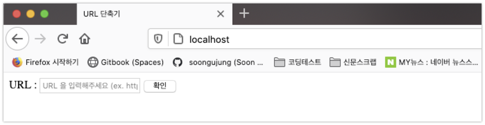
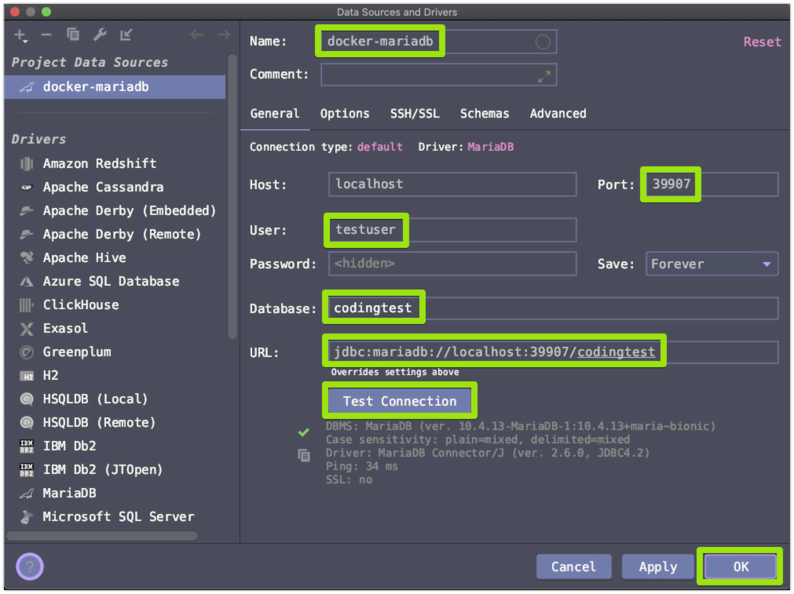

# URL 주소 단축 애플리케이션


# git clone

git clone https://github.com/soongujung/url-shortener.git


# 프로젝트 루트 디렉터리 이동

```bash
cd url-shortener
```


# Docker 기반 MySQL 구동

이 URL 단축기는 도커 컨테이너 기반의 MySQL을 사용하고 있습니다. 이런 이유로 도커 컨테이너를 구동/상태조회/컨테이너삭제/재기동/중지 스크립트를 따로 제공하고 있습니다. 각각의 용도에 대한 쉘 스크립트 사용법은 아래와 같습니다.


## MySQL 구동 or 재기동

아래 명령어를 통해 docker-mysql-start.sh 라는 이름의 쉘스크립트를 실행시킵니다.

```bash
# 배포 디렉터리로 이동
cd url-shortener/deploy/docker-mysql

# MySQL 구동스크립트 실행시킵니다.
source docker-mysql-start.sh
```


이 `docker-mysql-start.sh` 는 이미 구동되어 있는 상태에서 한번더 실행시 재기동을 하는 방식으로 구현되어 있습니다.


## MySQL 중지

아래 명령어를 통해 docker-mysql-stop.sh 라는 이름의 쉘스크립트를 실행시킵니다. 이 스크립트는 도커 컨테이너가 점유하고 있는 볼륨까지 모두 삭제하는 스크립트입니다.

```bash
# 배포 디렉터리로 이동
cd url-shortener/deploy/docker-mysql

# MySQL 중지스크립트를 중지킵니다.
source docker-mysql-stop.sh
```


## MySQL 컨테이너 상태 조회

MySQL 컨테이너의 상태를 조회하기 위한 쉘스크립트로 `docker-mysql-ls.start` 를 만들어두었습니다. 아래의 명령어를 사용하면 현재 MySQL 컨테이너의 상태를 조회할 수 있습니다.

```bash
# 배포 디렉터리로 이동
cd url-shortener/deploy/docker-mysql

# MySQL 컨테이너의 상태를 조회합니다.
source docker-mysql-ls.sh
```


## MySQL 컨테이너 접속

MySQL 컨테이너의 인스턴스에 직접 접속하는 것 역시 쉘 스크립트로 만들어 두었습니다. 아래의 명령어를 사용하시면 접속하실 수 있습니다.

```bash
# 배포 디렉터리로 이동
cd url-shortener/deploy/docker-mysql

# MySQL 컨테이너에 접속합니다.
source docker-mysql-repl.sh
```


# 애플리케이션 구동

애플리케이션을 구동시키는 것 역시 쉘 스크립트로 미리 준비해두었습니다. 아래의 명령어를 사용하시면 애플리케이션을 빌드하고 실행시키실 수 있습니다.

```bash
# 배포 디렉터리로 이동
cd url-shortener/deploy

# 애플리케이션 실행
source deploy.sh
```


# 애플리케이션 접속

브라우저에서 [http://localhost](http://localhost) 에 접속하시면 아래와 같은 화면을 확인 가능하십니다. 이 애플리케이션은 80 포트를 사용하고 있습니다. 따라서 실행이 안된다면, 80포트를 점유 중인 다른 프로세스를 잠시 중지시키고 실행해주시면 됩니다.




# 데이터베이스 접속정보 안내

- user
  - testuser
  - root
- password
  - 1111
- database
  - codingtest
- port
  - 39907

  



