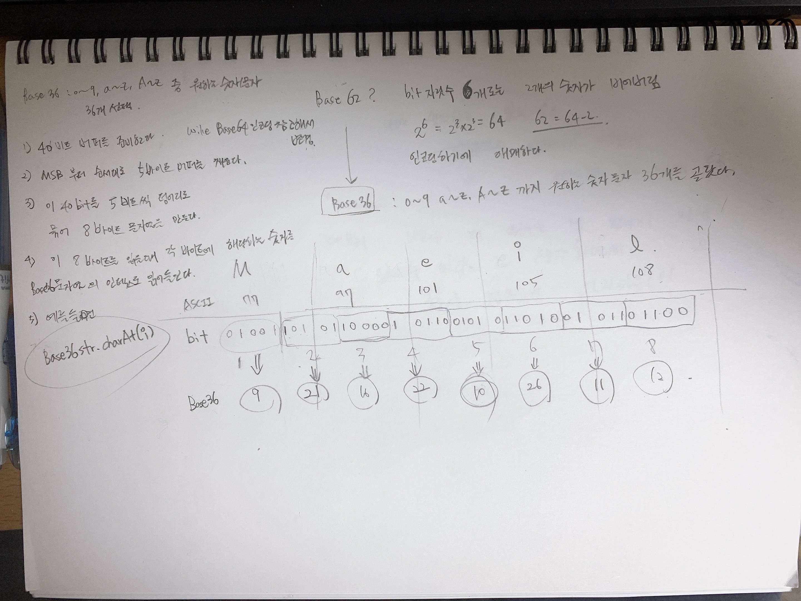

# 참고자료
- [Base62](https://en.wikipedia.org/wiki/Base62)
- [Base64 인코딩](https://ko.wikipedia.org/wiki/%EB%B2%A0%EC%9D%B4%EC%8A%A464)
- [BASE62 인코딩 커스터마이징](https://www.codeproject.com/Articles/1076295/Base-Encode)


# BASE62의 개념
BASE62 에 대한 자료는 [여기](https://en.wikipedia.org/wiki/Base62) 에 있다. 그런데 이게 뭐지? 하면서 잠깐당황했었다.  
  
차분하게 웹 검색을 해본 결과 BASE64 와 BASE62의 차이점을 설명하는 글들이 있었고, BASE62의 경우 BASE64 인코딩에서 `/`, `+` 을 빼고서 인코딩하는 개념으로 방향이 잡혔다.  
  
BASE62 인코딩 방식을 파악하기 위해서는 Base64 인코딩 방식을 파악해서 테스트 코드를 작성해보는게 먼저이겠구나... 하는 생각이 들게 되었다.  
  
이런 이유로 BASE64 인코딩을 정리해보면 아래와 같다.

# BASE64 인코딩 
> 참고자료 : [Base64 인코딩](https://ko.wikipedia.org/wiki/%EB%B2%A0%EC%9D%B4%EC%8A%A464)

**직접 그려본 그림**   


# BASE32 인코딩
BASE32 인코딩에 사용할 문자열은 아래와 같다. a~z, A~Z, 0~9 의 숫자들에서 원하는 문자, 숫자들을 선택해서 만든 문자열이다.
```java
private final String BASE_32_LETTERS 			= "0123456789ABCGHKMQTbceklmnopqxyz";
```

인코딩을 하는 과정을 그림으로 정리해봤다.

  

# 자바 바이너리 비트(이진수) 생성 및 표현

출근을 해야 해서... 나머지는 점심에 잠깐 짬을 내거나, 퇴근후에... ㅠㅜ


# 해싱함수 vs 랜덤함수 
두 가지 방법중 하나를 선택해야 한다. 일단은 Database의 시퀀스 기능을 사용하는 것으로 결정했다.
> 가능한 방법들
> - Database 의 시퀀스 기능을 이용해 1 ~ 99999 까지의 시퀀스를 만들기 (Base32방식의 인코딩을 하기로 했으므로 5자리까지만 필요)
>   - URL Shortening 요청에 대해 테이블에 INSERT를 수행한 후에 생성된 시퀀스 값에 대해 base32 인코딩을 수행한다.
> - google guava murmur3 을 이용한 압축알고리즘
>   - murmur3 압축으로 생성되는 문자열은 8자리인데, 이것을 5자리로 줄이면 Base32 인코딩을 통해 문자열을 줄일 수 있다.
  
  
> 참고
> - [Guava > Hashing API](https://guava.dev/releases/19.0/api/docs/com/google/common/hash/Hashing.html)
