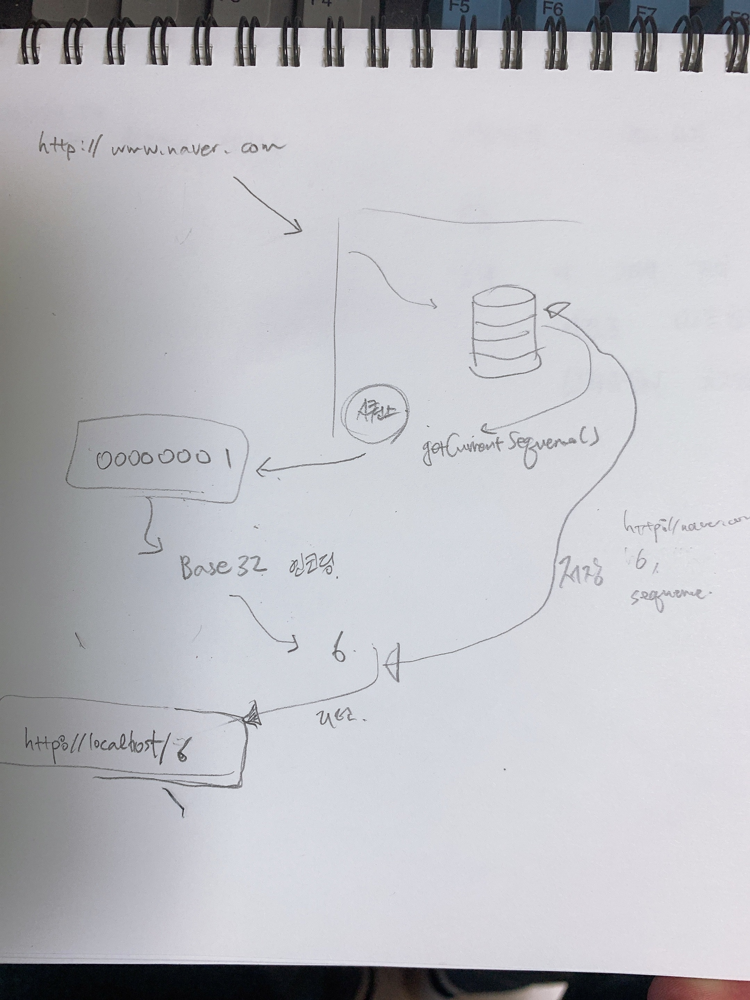

# URL Srotening 문제접근방식

# Overview

> URL Shortening 을 하기 위해서는 해당 요청에 대한 **고유키** 를 만들고, 이 **고유키를 BASE62 인코딩**을 하는 방식으로 다른 문자열을 만들어낸다.   

URL Shortening을 하려면 **입력값 하나에 대해 고유한 난수를 발생시키는 해시알고리즘을 사용**하거나 **고유 랜덤키를 발생**시키면 된다. 이 두가지 방식중 이번 프로젝트에서는 Database의 시퀀스 기능을 이용하기로 했다.  

## 해시알고리즘 or 랜덤키

고유 키를 발생시키려면  **입력값 하나에 대해 고유한 난수를 발생시키는 해시알고리즘을 사용**하거나 **고유 랜덤키를 발생**시키면 된다. 이 두가지 방식중 이번 프로젝트에서는 Database의 시퀀스 기능을 이용하기로 했다.  

  

## Base32 인코딩

점심시간, 퇴근후 정리.

